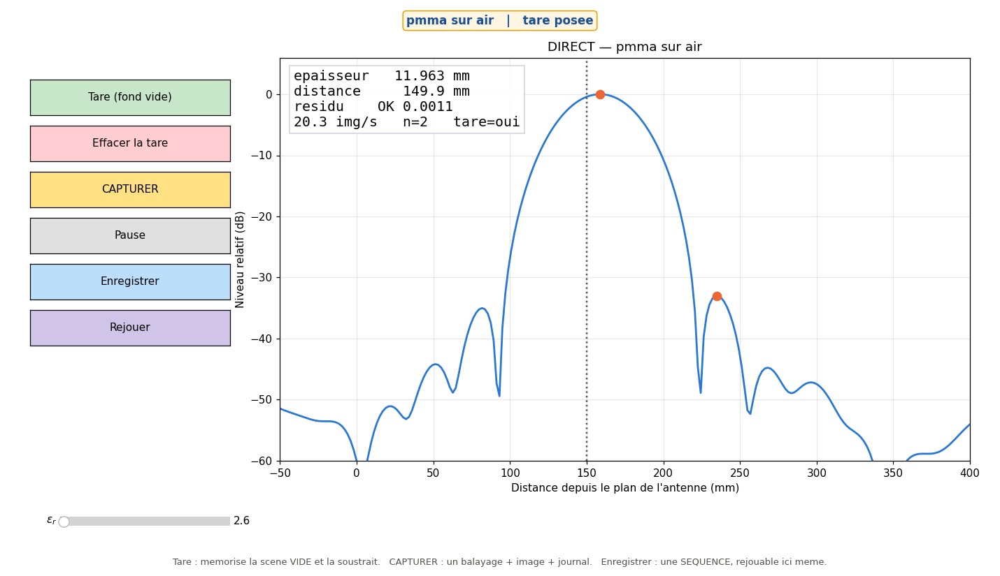
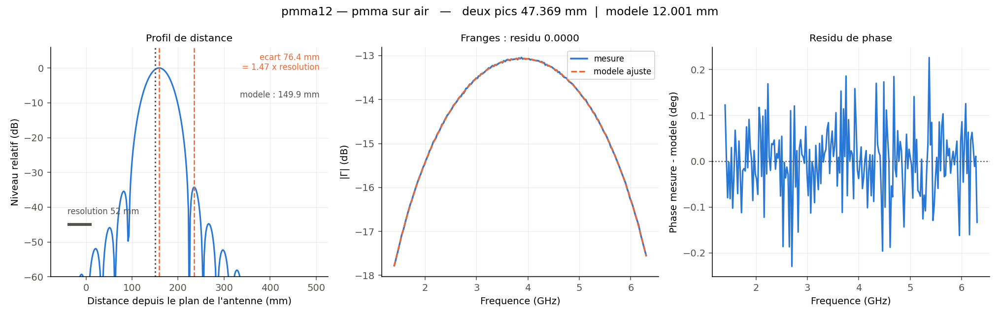
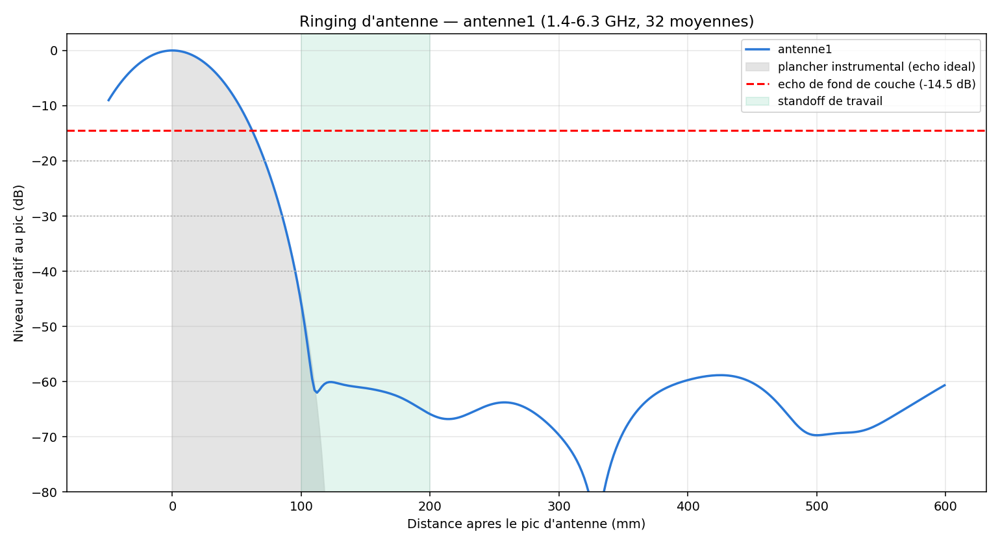
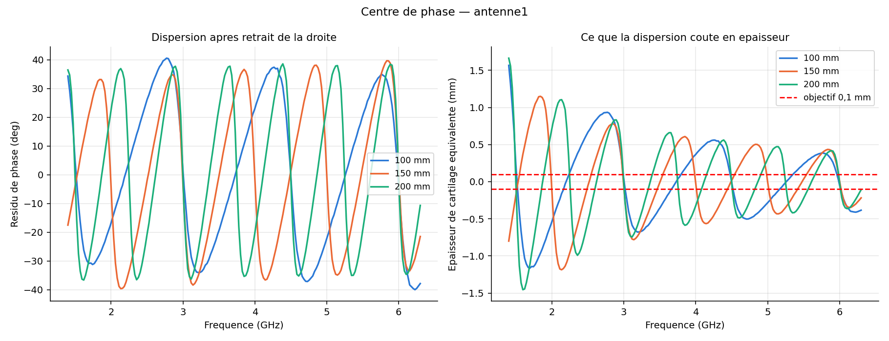

# Guide d'utilisation — Radar cartilage (LiteVNA)

Radar UWB à balayage de fréquence qui mesure **l'épaisseur d'une couche** (PMMA,
gélatine, cartilage…) et **la distance à sa surface**, sans contact, en exploitant les
franges d'interférence entre l'écho de surface et l'écho de fond.

---

## Vue d'ensemble

Trois programmes, plus une bibliothèque partagée. Rien d'autre.

| Programme | Rôle | Cadence |
|---|---|---|
| `calibration.py` | produit les **corrections** appliquées à chaque mesure | chaque session |
| `radar.py` | **la mesure** : direct, quantitative, enregistrement, rejeu | en permanence |
| `qualification.py` | rend un **verdict** sur l'antenne, ne corrige rien | une fois par antenne |
| *`noyau.py`* | *bibliothèque : modèle, traitement, acquisition* | *jamais lancée* |

> **Calibration ≠ qualification.** La première produit des *nombres* rangés dans
> `calibration/` et appliqués systématiquement. La seconde produit un *jugement* sur le
> matériel. On confond souvent les deux ; elles n'ont ni le même but ni la même cadence.

### La séquence complète

```
1.  python calibration.py --sol              # étalons Short / Open / Load
2.  python calibration.py --verifier         # plancher réel
3.  python calibration.py --plan 100 200     # plaque métal → plan de l'antenne
4.  python radar.py --mesure --nom fond --sans-graphe    # RIEN devant l'antenne
5.  python radar.py --mesure --nom pmma12 --fond fond \
        --milieu pmma --substrat air --max-ep 20
```

`python calibration.py --etat` dit à tout moment ce qui est en place et ce qui manque.

---

## Prise en main — la séquence complète en simulation

**À faire en premier, avant de brancher quoi que ce soit.** L'option `--simu`
remplace le LiteVNA par un instrument simulé : directivité −30 dB, désadaptation
−14 dB, câble de 2 ns, réflexion propre d'antenne et bruit réalistes. Toute la
séquence se déroule, les verdicts sont vrais, et aucun matériel n'est branché.

C'est la bonne façon d'apprendre : on peut se tromper, recommencer, et voir à quoi
ressemble un échec — ce qu'on ne veut pas découvrir avec des étalons à 0,5 N·m
entre les doigts.

### La séquence, dans l'ordre

```bash
# 0. La chaîne de calcul est-elle saine ?  (aucun instrument, même simulé)
python radar.py --autotest

# 1. Mise en route guidée : les cinq étapes, une à la fois
python calibration.py --simu

# 2. Une mesure sur plaque de PMMA de 12 mm placée à 150 mm
python radar.py --mesure --nom pmma12 --simu pmma12@150 \
       --milieu pmma --substrat air --max-ep 20 --fond fond

# 3. Le problème inverse : épaisseur connue, on cherche la permittivité
python radar.py --mesure --nom eps12 --simu pmma12@150 \
       --epaisseur 12.0 --substrat air --fond fond

# 4. L'affichage temps réel, avec ses commandes
python radar.py --live --simu pmma12@150 \
       --milieu pmma --substrat air --max-ep 20 --fond fond

# 5. Enregistrer une séquence, puis la rejouer
python radar.py --enregistre --nom essai --duree 20 --simu pmma12@150 \
       --milieu pmma --substrat air --max-ep 20 --fond fond
python radar.py --rejeu --nom essai --milieu pmma --substrat air --max-ep 20

# 6. Qualifier l'antenne
python qualification.py --ringing --nom essai --simu
python qualification.py --centre-phase --nom essai --simu

# 7. Où en est-on ?
python calibration.py --etat
```

### Ce que tu dois obtenir

| Étape | Résultat attendu | Si ce n'est pas ça |
|---|---|---|
| 0 | `VERDICT : REUSSI` | la chaîne de calcul est cassée, rien d'autre n'a de sens |
| 1 | directivité ≈ **−30,5 dB**, conditionnement ≈ **3,5** | un conditionnement > 50 signale des étalons mal distingués |
| 1 | vérification : **BON (−45 dB)** | |
| 1 | pente **0,998**, offsets **+702,2 et +702,0 mm** | une pente double = les deux distances ne sont pas celles qu'on croit |
| 2 | modèle **12,00 mm**, distance **149,9 mm**, résidu **0,0000** | |
| 2 | deux pics : **47,4 mm**, verdict **NON CONCLUANT** | c'est *voulu* : 1,47 × la résolution, la méthode A n'y est pas fiable |
| 3 | εr ≈ **2,60** | |
| 6 | deux graphes dans `qualification/` | |

L'étape 2 mérite un arrêt : **la méthode A se trompe d'un facteur quatre et le
programme le dit lui-même.** C'est le comportement normal sous 2,5 résolutions, et
c'est toute la raison d'être de l'inversion sur modèle.

### Essayer de rater

Le simulateur sert aussi à voir les modes d'échec, qui sont plus instructifs que les
succès :

```bash
# Sans soustraire le fond : epaisseur fausse, distance absurde, residu ~1
python radar.py --mesure --nom sansfond --simu pmma12@150 \
       --milieu pmma --substrat air --max-ep 20

# Avec un mauvais substrat : le residu s'envole
python radar.py --mesure --nom mauvais --simu pmma12@150 \
       --milieu pmma --substrat os --max-ep 20 --fond fond
```

Dans les deux cas le **résidu** dépasse 0,2 et le programme avertit. Apprends à le
regarder avant le chiffre d'épaisseur : c'est le seul juge.

### Passer au réel

Exactement les mêmes commandes, **sans `--simu`**. Les fichiers produits en
simulation vivent dans les mêmes dossiers : efface `calibration/`, `mesures/` et
`qualification/` avant la première vraie session, pour ne pas mélanger.

---

## 1. Le vocabulaire (les mots qui piègent)

| Mot | Ce que ça veut dire ici |
|---|---|
| **Calibration SOL** | Correction des erreurs du VNA avec étalons Short/Open/Load. **Pas** le menu CAL du LiteVNA, dont l'USB renvoie toujours des données brutes. |
| **Fond** | La réflexion **propre de l'antenne**. Additive, absente du modèle : elle doit être soustraite séparément du SOL. |
| **Plan de l'antenne** | L'origine des distances. Le SOL le place au **bout du câble** ; `--plan` le prolonge jusqu'au plan rayonnant. |
| **Standoff** | L'espace d'air devant l'antenne. **Jamais fourni au programme** : il est mesuré. |
| **Résolution** | c/2B ≈ 52 mm : l'écart minimal pour *séparer* deux échos. Ce n'est pas la précision. |
| **Permittivité (εr)** | Ralentit l'onde. Convertit l'écart apparent en épaisseur réelle. |
| **Résidu** | Écart entre la mesure et le modèle ajusté. **Le seul indicateur de confiance.** |

---

## 2. `calibration.py` — les corrections

### 2.0 L'assistant guidé — la façon normale de démarrer

Lancé **sans aucun argument**, le programme déroule la mise en route complète,
une étape à la fois. C'est le mode à utiliser tant que la séquence n'est pas
familière.

```
python calibration.py
```

Chaque étape se présente ainsi :

```
==========================================================================
  ETAPE 2/5 -- CALIBRATION SOL
==========================================================================
  POURQUOI : retire la directivite du pont, la desadaptation source et la
             reponse du cable. Sans elle les amplitudes sont fausses et le
             plancher de mesure reste haut.

  > Prepare les trois etalons : COURT-CIRCUIT, OUVERT, CHARGE.
  > Ils se vissent AU BOUT DU CABLE, la ou ira l'antenne.
  > NE DEPLACE PAS LE CABLE de toute l'operation : sa flexion
  >   change sa phase et ruine la calibration.
  > Serre fermement sans forcer, de la meme facon a chaque fois.

  [Entree] faire  |  [s] sauter  |  [q] quitter :
```

Trois choses à retenir :

- **le POURQUOI précède le comment.** On ne suit correctement une procédure
  qu'en sachant ce qu'elle corrige ;
- **on peut sauter ou quitter.** L'assistant détecte à l'étape 1 ce qui est déjà
  en place ; reprendre plus tard ne refait pas ce qui est fait ;
- **tout est consigné** dans `calibration/journal.txt`, avec l'horodatage. C'est
  ce journal qui permet de diagnostiquer à distance, des jours plus tard, ce qui
  s'est réellement passé.

### Les cinq étapes

| # | Étape | Ce que tu manipules | Ce qu'elle produit |
|---|---|---|---|
| 1 | État des lieux | rien | affiche ce qui manque |
| 2 | Calibration SOL | les trois étalons | `calibration/sol_courante.npz` |
| 3 | Vérification | la charge seule | un verdict BON / ACCEPTABLE / INSUFFISANT |
| 4 | Plan de référence | l'antenne + plaque métal à 100 puis 200 mm | `calibration/plan.npz` |
| 5 | Fond d'antenne | rien devant l'antenne | `mesures/fond.npz` |

### Apprendre sans matériel

L'option `--simu` remplace le LiteVNA par un instrument simulé — directivité
−30 dB, désadaptation −14 dB, câble de 2 ns, réflexion d'antenne et bruit
réalistes :

```
python calibration.py --simu
```

Toute la séquence se déroule, les verdicts sont vrais, et rien n'est branché.
C'est la bonne façon de se familiariser avant de toucher au matériel.

### 2.1 Pourquoi le menu du LiteVNA ne suffit pas

Le LiteVNA a bien un menu **CAL**, mais **son interface USB renvoie toujours des données
brutes, par conception** : sa calibration ne corrige que son propre écran. Garde-la pour
viser confortablement ; la correction utile au logiciel se fait ici.

Ce que la calibration SOL retire :

| Terme | Ce que c'est | Effet visible sans elle |
|---|---|---|
| **Directivité** `e00` | fuite du pont vers le récepteur | faux écho à distance nulle, plancher élevé |
| **Désadaptation source** `e11` | allers-retours VNA ↔ antenne mal adaptée | échos fantômes périodiques |
| **Suivi en réflexion** `e10e01` | réponse du câble et du pont | amplitudes fausses |

### 2.2 Le montage — la partie qui décide de tout

- Visse les étalons **au bout du câble**, là où ira l'antenne.
- **Ne déplace pas le câble** entre les trois mesures : sa flexion change sa phase.
- Serre les SMA à **0,5 N·m**, à la clé dynamométrique, et de la même façon pour
  les trois.

> **Pourquoi un couple, et pourquoi celui-là.** Le newton-mètre est l'unité de
> couple : une force multipliée par un bras de levier, ce que règle une clé
> dynamométrique. La calibration SOL suppose que les trois étalons présentent
> exactement la réflexion annoncée par leur fabricant, au même plan de référence.
> Or sur un SMA, **trop peu serré** déplace ce plan de quelques dixièmes de
> millimètre — et décale donc toutes les distances mesurées ensuite ; **trop
> serré** déforme le diélectrique et abîme l'étalon, qui ment alors sans le dire ;
> **serré différemment d'un étalon à l'autre**, les trois ne partagent plus le même
> plan, ce qui est précisément ce que la calibration cherche à déterminer. C'est le
> symptôme que `--sol` signale par un conditionnement supérieur à cinquante.

### 2.3 Les cinq modes

| Mode | Commande | Quand |
|---|---|---|
| **SOL** | `calibration.py --sol` | début de session, ou changement de câble |
| **Vérification** | `calibration.py --verifier` | juste après |
| **Plan de référence** | `calibration.py --plan 100 200` | changement d'antenne |
| **État** | `calibration.py --etat` | à tout moment |
| **Rejeu** | `calibration.py --rejouer --short-l0 0.1e-9` | recalcul sans remesurer |

Le SOL enchaîne court-circuit, ouvert, charge. Pour chacun il moyenne **vectoriellement**
16 balayages (−12 dB de plancher) et **contrôle la plausibilité** : un short ou un open
doit renvoyer ~0 dB, une charge doit absorber. Il prévient sinon.

### 2.4 Lire la vérification

| Verdict | Signification |
|---|---|
| **BON** (< −35 dB) | marge confortable sous l'écho de fond (~−17 dB) |
| **ACCEPTABLE** (< −25 dB) | utilisable, mais la charge du kit limite le plancher |
| **INSUFFISANT** | reprends le serrage, puis la charge elle-même |

### 2.5 Le plan de référence

Une plaque métallique à **deux** distances connues donne deux nombres :

- **la pente** doit valoir 1,000 — elle vérifie l'échelle des distances ;
- **l'offset**, constant, est la position du plan de l'antenne.

> Un offset qui change entre les deux positions n'est **pas** une erreur de plan de
> référence. Le plus souvent, les deux distances ne sont pas celles qu'on croit :
> confondre « à 200 mm » et « de 200 mm » donne exactement une pente double. C'est
> arrivé, et cela a faussé une campagne entière.

### 2.6 Faut-il un kit d'étalons caractérisé ?

Biais résultant sur une couche de 1 à 5 mm, simulation de la chaîne complète :

| Défaut ignoré | Biais | |
|---|---|---|
| Ouvert, 20 à 100 fF | 0,01 à 0,04 mm | négligeable |
| Offsets de 5 ps | 0,03 mm | négligeable |
| Court-circuit, 0,10 nH | 0,07 mm | acceptable |
| Court-circuit, 0,30 nH | 0,98 mm | **rédhibitoire** |
| Charge à −25 dB au lieu de −45 | 1,24 mm | **rédhibitoire** |

L'ordre est **charge ≫ court-circuit ≫ ouvert** — l'inverse de l'intuition. Ce qui est
linéaire en fréquence est absorbé par le plan de référence ; seule la courbure subsiste.

> **La charge 50 Ω est la pièce critique du kit.** C'est elle qui fixe le plancher.

### 2.7 Saisir les coefficients d'étalons

Par défaut les étalons sont supposés **idéaux** — ce qui, d'après le tableau ci-dessus,
est sans conséquence sauf pour la charge. Si ton fabricant publie ses coefficients :

| Option | Étalon | Unité |
|---|---|---|
| `--open-c0` … `--open-c3` | capacité de frange de l'ouvert, `C(f) = c0 + c1·f + c2·f² + c3·f³` | F, F/Hz… |
| `--short-l0` … `--short-l3` | inductance du court-circuit, même forme | H, H/Hz… |
| `--open-offset-ps`, `--short-offset-ps` | retard d'offset | ps |

```
python calibration.py --sol --open-c0 55e-15 --short-l0 0.1e-9
```

Et surtout, **sans rien remesurer**, sur des balayages déjà enregistrés :

```
python calibration.py --rejouer --short-l0 0.1e-9
```

C'est tout l'intérêt de conserver les balayages bruts : on peut améliorer le modèle
d'étalons des mois après la mesure.

---

## 3. `radar.py` — la mesure

Il donne **toujours la distance et l'épaisseur** : les deux sortent du même ajustement,
et la distance n'est jamais fournie — elle est estimée.

### 3.1 Les quatre modes

| Mode | Commande | Ce qu'il fait |
|---|---|---|
| **Direct** | `radar.py --live` | temps réel : viser, contrôler, voir entrer un parasite |
| **Mesure** | `radar.py --mesure --nom X` | N balayages moyennés, les deux estimateurs, graphe |
| **Enregistrement** | `radar.py --enregistre --nom X --duree 30` | séquence de balayages **bruts** horodatés |
| **Rejeu** | `radar.py --rejeu --nom X` | rejoue à la vitesse d'origine, sans instrument |

Les données enregistrées sont **non calibrées** : on peut les recalculer plus tard avec
une meilleure calibration. C'est ce que la calibration embarquée du LiteVNA interdit.

### 3.2 Les options

| Option | Rôle |
|---|---|
| `--milieu` | la couche : `pmma`, `cartilage`, `verre`… ou une valeur de εr |
| `--substrat` | ce qu'il y a **derrière** : `air`, `os`, `metal`, `eau`… |
| `--max-ep` | épaisseur maximale explorée (mm) — un peu au-dessus de l'attendu |
| `--fond` | balayage « scène vide » à soustraire — **indispensable en réel** |
| `--epaisseur` | épaisseur connue : inverse le problème et mesure εr (§4.4) |
| `--moy` | balayages moyennés (16 par défaut) |
| `--sigma` | conductivité de la couche (S/m). En mode `--epaisseur` : **0 par défaut**, car le matériau est justement inconnu |
| `--vitesse` | rejeu : 1 = temps réel, 0 = le plus vite possible |
| `--portee` | bord droit de l'affichage en direct (500 mm par défaut) |
| `--duree` | durée d'enregistrement, s |
| `--autotest` | valide toute la chaîne sur données synthétiques, sans instrument |
| `--simu` | instrument **simulé** : apprendre et tester sans matériel |
| `--capture-ecran` | enregistre une image de la fenêtre temps réel puis quitte |

**Commence toujours par `--autotest`** : il doit retrouver la vérité à 0,000 mm de 1 mm
de cartilage à 80 mm de plastique.

### 3.3 Les deux estimateurs

Les deux tournent systématiquement sur le **même** balayage.

**A — Détection à deux pics.** Sans modèle : transformée inverse, recherche des deux pics
les plus saillants. Fiable **seulement au-delà de 2,5 largeurs de résolution**. En deçà
elle est biaisée de plusieurs pour cent, et sous une résolution elle rend une valeur
**fausse mais plausible** — plus dangereux qu'un échec franc.

**B — Modèle stratifié.** Ajuste le coefficient de réflexion exact, en laissant libres
l'épaisseur, le standoff et un gain complexe. **Exact à toute épaisseur.** C'est lui qui
mesure.

Le programme signale lui-même quand la comparaison n'a pas de sens.

### 3.4 La fenêtre temps réel

`--live`, `--enregistre` et le rejeu d'une séquence ouvrent cette fenêtre :



Elle sert à **viser**. Sans retour visuel continu on ne peut ni orienter une
antenne, ni voir qu'un objet parasite est entré dans la scène, ni repérer une
dérive.

| Élément | Rôle |
|---|---|
| **Bandeau supérieur** | le milieu mesuré, et si la tare est posée. Passe en **RÉSIDU ÉLEVÉ** quand le modèle ne décrit plus la mesure |
| **Cadre de lecture** | épaisseur, distance, résidu (préfixé `OK` ou `!!`), cadence, numéro d'image, état de la tare |
| **Courbe bleue** | profil de distance, origine au plan de l'antenne |
| **Points orange** | les deux pics détectés par la méthode A |
| **Trait pointillé** | la distance trouvée par le modèle |
| **Tare (fond vide)** | mémorise la scène courante comme fond et l'enregistre dans `mesures/fond.npz`. À presser **rien devant l'antenne** |
| **Effacer la tare** | revient au signal non corrigé du fond |
| **CAPTURER** | enregistre le balayage brut, une image de la fenêtre, et une ligne dans `mesures/journal.txt` |
| **Pause** | fige l'affichage sans interrompre l'acquisition |
| **Curseur εr** | change la permittivité **en direct** : l'épaisseur se recalcule immédiatement |
| **Enregistrer** | démarre une séquence de balayages **bruts** ; le bouton devient **ARRÊTER** et le cadre de lecture affiche le nombre acquis. À l'arrêt, la séquence part dans `mesures/<nom>_seq_NN.npz` |
| **Rejouer** | rejoue la dernière séquence **dans cette même fenêtre**, puis rend la main à l'instrument. Sans séquence enregistrée, il le dit et ne fait rien |

> **Enregistrer** existe parce qu'on ne sait qu'une séquence mérite d'être gardée
> qu'en la voyant passer. Avant, il fallait le décider au lancement avec
> `--enregistre`. Une séquence en cours est écrite même si la fenêtre est fermée
> ou si l'on interrompt par Ctrl-C : une acquisition ne doit pas se perdre.

> **Scène qui évolue.** Le simulateur joue une **liste** de scènes, une par
> balayage : `--simu "pmma12@120,pmma12@140,pmma12@160"`. Avec une seule scène,
> la dernière se répète et rien ne change. Le mode direct avance désormais cette
> liste à chaque balayage — il ne le faisait pas, si bien que la cible restait
> figée et que seul le bruit variait. C'est ainsi qu'on obtient une plaque qui
> se déplace, avec la distance qui suit et l'épaisseur qui, elle, ne bouge pas.

> **`--film DOSSIER --images N`** enregistre une suite d'images de la fenêtre.
> C'est ce qui alimente le plan animé du tutoriel vidéo : une image fixe ne
> montre pas ce qui fait tout l'intérêt du mode direct.

> Le curseur εr est le meilleur moyen de sentir la dégénérescence épaisseur /
> permittivité : déplace-le et regarde l'épaisseur bouger. C'est exactement le
> facteur 10 dont parle le §7.

Pour se familiariser sans matériel :

```
python radar.py --live --simu pmma12@150 --milieu pmma --substrat air --max-ep 20
```

Scènes disponibles : `pmma12@150`, `cartilage3@120`, `metal@200`, `vide`, et
plus généralement `<milieu><épaisseur>@<distance>`.

### 3.5 Le graphe de diagnostic

Le mode `--mesure` produit ce graphe dans `mesures/<nom>.png` :



| Panneau | Ce qu'il montre | Ce qu'il faut y voir |
|---|---|---|
| **Gauche** | profil de distance, pics, distance du modèle, barre d'échelle de la résolution | la cible est-elle bien isolée ? est-elle dans la fenêtre utile ? |
| **Centre** | franges \|Γ(f)\| mesurées et modèle ajusté | **le contrôle décisif** : les deux courbes doivent se superposer |
| **Droite** | résidu de phase, degré par degré | doit rester du bruit, sans structure |

> Si la courbe orange ne suit pas la bleue sur le panneau central, **le chiffre
> d'épaisseur n'a aucune valeur**, quelle que soit sa vraisemblance. C'est le
> seul juge.

### 3.6 Ce qu'affiche la console

```
  A. Deux pics .........   47.391 mm
     pics a 128.8 et 205.2 mm, ecart 76.4 mm (1.47 x la resolution de 52 mm)
  B. Modele stratifie ..   12.000 mm   (residu -0.0000)
     DISTANCE a la 1re surface :    120.0 mm
  -> NON CONCLUANT. A 1.47 x la resolution, ...
```

Le **résidu** est le seul indicateur de confiance : au-dessus de 0,2 le modèle ne décrit
pas la mesure et le chiffre n'a aucune valeur. Le graphe le montre — si la courbe orange
ne se superpose pas à la bleue sur le panneau central, ne crois pas le nombre.

---

## 4. Objets de test

L'objet recommandé est une **plaque de PMMA posée sur du polystyrène expansé**.

> **PMMA** = polyméthacrylate de méthyle, le plastique transparent rigide vendu sous les
> noms **Plexiglas**, **Altuglas** ou **Perspex**.

### 4.1 Pourquoi celui-là

Une lame libre dans l'air a deux interfaces de coefficients égaux au signe près : **ses
deux échos ont la même amplitude**, le cas le plus facile qui soit.

| | Écho de surface | Écho de fond | Écart |
|---|---|---|---|
| **PMMA libre dans l'air** | −12,6 dB | −13,1 dB | **0,5 dB** |
| Cartilage sur os | −2,6 dB | −16,5 dB | 13,9 dB |

### 4.2 Quelle épaisseur

L'axe des distances est en aller simple : l'écart apparent vaut `√εr × épaisseur`, soit
**1,61 × l'épaisseur** pour le PMMA.

| Plaque | Écart apparent | / résolution | ≡ cartilage de | Précision (30 dB) |
|---|---|---|---|---|
| 2 mm | 3,2 mm | 0,06 × | 0,51 mm | ±0,218 mm |
| 4 mm | 6,4 mm | 0,12 × | 1,02 mm | ±0,069 mm |
| **12 mm** | 19,3 mm | 0,37 × | **3,06 mm** | **±0,012 mm** |
| 80 mm | 129 mm | 2,5 × | — | la seule où les deux méthodes s'accordent |

Le rapport `√40 / √2,6 = 3,92` fait qu'une plaque de 12 mm place le logiciel exactement
dans le régime d'un cartilage de 3 mm. Un jeu **2 / 4 / 12 mm** couvre l'essentiel, et
leur rapport 6:1 permet de vérifier la **linéarité** de l'estimateur.

### 4.3 Détails pratiques qui font rater l'essai

- **Rien derrière la plaque.** Pose-la sur un bloc de **polystyrène expansé** : εr ≈ 1,03,
  invisible aux micro-ondes.
- **Plaque d'au moins 300 × 300 mm**, sinon les bords diffractent.
- **N'empile jamais deux plaques** : le film d'air crée deux interfaces parasites.
- **Demande du PMMA _coulé_** (« cast »), pas extrudé : l'extrudé a ±5 % de tolérance
  d'épaisseur. Mesure au pied à coulisse en cinq points.

### 4.4 Le test qui vaut tous les autres : mesurer εr

Tu connais l'épaisseur au pied à coulisse et εr du PMMA par la littérature (**2,6**). On
peut donc **inverser le problème** :

```
python radar.py --mesure --nom pmma12 --epaisseur 12.0 --substrat air --fond fond
```

Il doit rendre εr ≈ 2,6. Précision théorique :

| Plaque | εr à 20 dB | à 30 dB | à 40 dB |
|---|---|---|---|
| 2 mm | ±0,94 | ±0,30 (11 %) | ±0,094 |
| 4 mm | ±0,16 | ±0,050 (1,9 %) | ±0,016 |
| **12 mm** | ±0,017 | **±0,0055 (0,21 %)** | ±0,0017 |

Une plaque de 12 mm détermine εr à **0,2 %** — mieux qu'aucune table publiée. C'est
exactement la procédure qu'il faudra appliquer au cartilage.

| Symptôme | Diagnostic |
|---|---|
| εr ≈ 2,6 | la chaîne complète est validée |
| εr trop grand d'un facteur k² | l'échelle des distances est fausse d'un facteur k |
| Résidu > 0,2 | quelque chose derrière la plaque, ou calibration absente |

### 4.5 Progression

| | Objet | Ce qu'il valide |
|---|---|---|
| 1 | Plaque métallique | Γ = −1 : échelle, plan de référence, phase (`--plan`) |
| 2 | PMMA 80 mm *(optionnel)* | les deux méthodes concordent à 2 % |
| 3 | PMMA 12 mm | équivalent d'un cartilage de 3 mm |
| 4 | PMMA 4 puis 2 mm | équivalent de 1 puis 0,5 mm — le cas extrême |
| 5 | Gélatine sur plaque de verre | εr ≈ 40 sur ≈ 7 : la géométrie cartilage/os |

---

## 5. `qualification.py` — juger l'antenne

Ne produit **aucune correction**, seulement un verdict. À relancer au changement
d'antenne.

| Essai | Commande | Ce qu'il mesure |
|---|---|---|
| **Ringing** | `qualification.py --ringing --nom taoglas` | durée de la traînée de l'antenne |
| **Centre de phase** | `qualification.py --centre-phase --nom taoglas` | dispersion, convertie en épaisseur équivalente |

**Ringing** : le signal mesuré est h_antenne ∗ h_cible. Une antenne résonante « sonne »,
et cette traînée masque l'écho de fond, déjà 14,5 dB sous la surface. Fenêtre de
Blackman-Harris (lobes à −92 dB) pour ne pas confondre les jupes de fenêtre avec du vrai
ringing. Verdict sur le ringing **net**, corrigé du plancher instrumental.

L'essai de centre de phase se fait à plusieurs distances, réglables par `--distances`
(100, 150 et 200 mm par défaut) :

```
python qualification.py --centre-phase --nom taoglas --distances 100 150 200
```

**Centre de phase** : une plaque métallique est un réflecteur parfait connu, donc le
résidu de phase après retrait d'une droite *est* la fonction de transfert de l'antenne.
Seule la **courbure** nuit : la partie linéaire est un retard, absorbé par le plan de
référence. Une excursion linéaire de 10 mm ne coûte que 0,094 mm.

### 5.1 Les deux sorties

Chaque essai écrit un graphe dans `qualification/` et rend un verdict en console.



Le **ringing** se lit par rapport à deux repères : la zone verte est le standoff de
travail, la ligne rouge l'écho de fond de couche à −14,5 dB. La zone grise est le
*plancher instrumental* — les jupes de la fenêtre d'apodisation. Le verdict porte sur
le ringing **net**, c'est-à-dire la traînée mesurée moins ce plancher : sans cette
soustraction on confondrait l'artefact de traitement avec un défaut d'antenne.



Pour le **centre de phase**, le panneau de droite est celui qui décide : il convertit
la dispersion en épaisseur de cartilage équivalente, à comparer directement aux
±0,1 mm de l'objectif.

### 5.2 Les deux modes en simulation

```
python qualification.py --ringing --nom essai --simu
python qualification.py --centre-phase --nom essai --simu
```


---

## 6. Dépannage

| Symptôme | Cause probable → action |
|---|---|
| `[cal] Aucune calibration` | normal si tu n'en as pas fait ; sinon vérifie le `--cal` |
| `[cal] balayage different` | calibration faite sur une autre bande → refais-la |
| `[fond] AUCUN` | enregistre un fond : `radar.py --mesure --nom fond`, rien devant |
| **Résidu > 0,2** | εr ou substrat faux, fond non soustrait, cible hors axe, ou objet parasite |
| **Épaisseur absurde, distance négative** | presque toujours le fond non soustrait |
| **Les deux méthodes divergent** | normal sous 2,5 résolutions — le programme le dit |
| **Verdict `--verifier` INSUFFISANT** | serrage des connecteurs, puis la charge 50 Ω |
| **Conditionnement > 50** | deux étalons trop semblables → l'un est mal vissé |
| **Distances toutes décalées** | refais `calibration.py --plan 100 200` |

---

## 7. Limites à connaître

- **Résolution ≈ 52 mm dans l'air** (fenêtre comprise), soit ~8 mm dans un milieu à
  εr = 45. Deux interfaces plus proches fusionnent : c'est une limite **mathématique**,
  pas un problème de bruit. C'est pour cela que l'inversion sur modèle existe.
- **La précision ne dépend presque pas de la bande** : doubler la bande gagne 21 %,
  ignorer εr coûte un facteur 10. Le poste dominant est **la connaissance de εr**.
- **La calibration ne survit pas au déplacement du câble.** Toute flexion change sa
  phase. Si tu bouges le montage, refais-la.
- **Le résidu est le seul juge.** Un chiffre d'épaisseur sans son résidu ne veut rien
  dire.
- **201 points, pas 101.** À 101 points la rampe de phase du standoff n'est
  échantillonnée que 3,6 fois par frange : l'ajustement devient trente fois plus lent et
  moins sûr.

---

## 8. Le tutoriel vidéo

Le tutoriel reprend en images ce que ce guide dit en mots : six segments, trente-six
plans. La version commentée dure **6 min 57 s**, la version muette 10 min 28 s : la
lecture réelle est plus rapide que l'estimation à quinze caractères par seconde qui
cadence les plans silencieux. Il se fabrique à partir des mêmes copies d'écran que le
guide, donc il ne peut pas dériver du logiciel réel.

### 8.1 La commande

La séquence, dans l'ordre :

```
python tutoriel_contenu.py --etat            1. où en est-on
python tutoriel_contenu.py --audio           2. si un commentaire a changé
python tutoriel_contenu.py --tout --voix     3. fabrique la vidéo
```

Si les copies d'écran doivent être refaites — le logiciel a changé d'aspect :

```
python tutoriel_contenu.py --ecrans --tout --voix
```

> **Ne lancez jamais `--ecrans` seul.** Il recapture *puis enchaîne sur une
> génération* : sans `--voix`, cette génération est **muette** et écrase la version
> commentée.

Variantes :

```
python tutoriel_contenu.py --tout                      version muette
python tutoriel_contenu.py --tout --voix --segment 4   un seul segment
python tutoriel_contenu.py --diag                      ce que permet la clé
```

**Pour la version commentée, faites `--audio` d'abord.** Ce mode ne fait que
synthétiser les trente-six commentaires, vérifie chacun sur le disque et affiche un
bilan. Une fois tous les commentaires en cache, `--tout --voix` travaille **hors ligne**
et n'exige plus de clé du tout : il l'annonce par « Commentaires : tous en cache, aucun
appel réseau ». Une interruption ne peut donc plus rien coûter.

**Utilisez toujours `--tout`.** Sans cette option la génération se fait d'un seul
tenant, et elle s'interrompt (voir §8.5).

La configuration d'ElevenLabs fait l'objet du §8.2. La version muette, elle, ne
demande rien.

### 8.2 Configurer ElevenLabs

#### La clé

Sur **elevenlabs.io**, menu du compte → **API Keys** → *Create API Key*. Une clé
valide commence par `sk_` et fait **exactement 51 caractères**.

Cochez au minimum **Text to Speech**. C'est le seul droit indispensable : sans lui
rien ne fonctionne, avec lui tout fonctionne. Deux autres sont confortables sans
être nécessaires :

| Droit | Sans lui |
|---|---|
| **Text to Speech** | rien ne marche — `--audio` s'arrête avant de dépenser |
| *Voices* (lecture) | le programme ne peut pas lister vos voix ; il retombe sur cinq voix intégrées (`charlotte`, `rachel`, `antoni`, `bella`, `adam`) et prend Charlotte par défaut |
| *User* (lecture) | le programme ne peut pas afficher l'état du compte ; sans conséquence |

#### La variable d'environnement

La clé se lit **uniquement** dans `ELEVENLABS_API_KEY` — jamais dans un fichier du
dépôt, jamais sur une ligne de commande, jamais dans une conversation.

```
PowerShell, cette fenêtre seulement :  $env:ELEVENLABS_API_KEY = "sk_..."
PowerShell, de façon permanente     :  setx ELEVENLABS_API_KEY "sk_..."
```

`setx` n'affecte que les fenêtres **ouvertes ensuite** : un processus ne relit jamais
son environnement une fois démarré. Après un `setx`, fermez la console et rouvrez-en
une.

Pour contrôler sans exposer la clé :

```
$env:ELEVENLABS_API_KEY.Substring(0,6)      doit afficher  sk_...
$env:ELEVENLABS_API_KEY.Length              doit afficher  51
python tutoriel_contenu.py --diag           teste les droits pour de vrai
```

`--diag` est le seul contrôle qui vaille : il fait une vraie synthèse de quatre
caractères. Le contrôle de longueur ne dit **rien** des permissions — une clé
parfaitement formée peut n'avoir aucun droit.

#### Les quatre façons de se tromper

Toutes ont été rencontrées sur ce projet ; le programme les nomme désormais.

| Symptôme | Cause | Remède |
|---|---|---|
| `HTTP 401 Unauthorized` et la clé ne commence pas par `sk_` | c'est l'**identifiant** de la clé, affiché dans la liste, pas la clé elle-même | recopier la valeur donnée **à la création** ; elle n'est plus affichée ensuite |
| `API key must be exactly 51 characters, got 67` | deux clés collées bout à bout | ne coller qu'une clé |
| `missing the permission voices_read` ou `user_read` | droits de lecture absents | sans gravité : le programme bascule sur ses cinq voix intégrées |
| `missing the permission text_to_speech` | le droit essentiel manque | le cocher sur la clé, ou en créer une autre |

#### Choisir la voix

```
python tutoriel_contenu.py --audio --nom-voix rachel
```

Le nom peut être celui d'une de vos voix — le programme interroge votre compte si le
droit *Voices* est accordé — ou l'un des cinq noms intégrés, ou directement un
identifiant de voix. Sans `--nom-voix`, c'est Charlotte, choisie pour son timbre en
français.

Changer de voix **change tous les fichiers audio**, donc les trente-six commentaires
sont resynthétisés. Le texte, lui, n'ayant pas bougé, les anciens restent sur le
disque et `--audio` les signale comme orphelins.

### 8.3 Accents : la prose oui, la console non

Les commentaires et les titres portent leurs accents. Ce n'est pas de la coquetterie :
la synthèse vocale lit ce qu'on lui donne, et sans accent elle prononce « etape » au lieu
d'« étape », confond « a » et « à », « ou » et « où ». Les commentaires servant aussi de
légende à l'image, la faute serait doublement visible.

Les blocs de console, eux, restent en **ASCII pur** — délibérément. Les trois programmes
n'impriment aucun caractère accentué (vérifié : 191 lignes `print`, zéro accent), et un
tutoriel qui montrerait une sortie plus soignée que la vraie mentirait sur ce que
l'utilisateur verra à l'écran.

Conséquence pratique : **reformuler un commentaire change son empreinte**, donc le
resynthétise. `--audio` signale les fichiers devenus orphelins et les conserve, au cas où
le texte reviendrait en arrière.

### 8.4 Rien n'est refait deux fois

Un plan déjà encodé est conservé si son `.mp4` est plus récent que `tutoriel.py` et
`tutoriel_contenu.py`. Modifier le texte d'un seul plan ne refait que celui-là. Les
commentaires synthétisés sont mis en cache par empreinte du texte : **une relance ne
refacture rien** chez ElevenLabs.

Un plan muet et le même plan commenté sont **deux fichiers distincts** (`s03p02.mp4`
et `s03p02v.mp4`). Sans cette distinction, lancer `--tout --voix` après une génération
muette faisait sauter les trente-six plans comme « déjà faits » : la synthèse n'était
jamais appelée et la vidéo restait silencieuse. Les deux versions coexistant, passer
d'un mode à l'autre ne jette jamais le travail déjà fait.

Les commentaires payés sont rangés à part, dans `docs/tutoriel/voix/`, et non dans
`docs/tutoriel/travail/` qui est entièrement réécrit à chaque passage. Un ménage sur les
fichiers jetables ne peut donc pas détruire ce qui a été facturé.

`voix()` **vérifie son écriture** : après chaque synthèse, le fichier doit exister et
peser plus d'un kilo-octet, sinon la génération s'arrête avec un message nommant le
chemin. Ce contrôle existe parce que le cas s'est produit — seize commentaires ont été
synthétisés, donc facturés, sans se retrouver dans le cache, ce qui refacturait
silencieusement à chaque relance. La cause n'est pas identifiée ; le contrôle la rendra
visible au lieu de la laisser coûter.

La durée d'un plan commenté est **calée sur celle de son commentaire**, mesurée sur le
fichier audio. `-shortest` seul ne suffit pas : l'image bouclée est un flux infini et
x264 vide son tampon d'anticipation avant de s'arrêter, ce qui ajoutait six secondes
de silence à la fin de chaque plan — plus de trois minutes sur l'ensemble.

### 8.5 Un défaut connu, et pourquoi `--tout` existe

La génération s'interrompt par moments sans message, sans trace d'exception et avec
un code de sortie nul, après quinze à trente plans, à un endroit qui change d'une fois
sur l'autre.

Ce n'est aucun des suspects habituels. Chacun a été mis à l'épreuve isolément sur
cette machine :

| Composant testé seul | Résultat |
|---|---|
| ffmpeg en rafale | 393 encodages en 120 s, sans incident |
| rendu de texte Pillow, six polices | 4 647 rendus en 90 s |
| Pillow + ffmpeg, code minimal hors projet | 65 tours, sans incident |
| un seul type de plan + ffmpeg | 4 essais sur 4 sans incident |
| **types de plans mélangés + ffmpeg** | **meurt 5 fois sur 6** |

Ni la mémoire (47 Mo constants), ni les descripteurs (212 constants), ni le nombre de
processus, ni l'espace disque ne bougent, et le journal d'événements Windows ne
mentionne rien. L'interruption emporte **tout le groupe de processus attaché à la
console** : au premier essai, le superviseur est mort en même temps que son enfant.

Une piste extérieure reste ouverte : sur cette machine, Windows Defender est **désactivé**
(`Get-MpPreference` échoue avec 0x800106ba) et c'est **Acronis Cyber Protect** qui assure
la protection, avec `AcronisActiveProtectionService` en service actif. Ce module surveille
les processus qui créent beaucoup de fichiers et peut les arrêter. Écrire 1 800 fichiers
média en trois secondes ne l'a pas déclenché, donc ce n'est pas prouvé — mais exclure
`C:\Jacques\liteVNA` de sa surveillance est une expérience gratuite qui vaut d'être faite.

D'où la parade, qui ne cherche pas à corriger la cause mais à la rendre sans effet :
chaque tentative conserve les plans déjà encodés, et le superviseur lance ses enfants
dans un groupe de processus séparé, ce qui lui permet de survivre et d'enchaîner. Trois
ou quatre passages suffisent. La progression de chaque tentative s'affiche **au fil de
l'eau**, plan par plan : sans cela, l'enfant écrivant dans un journal, la console restait
muette plusieurs minutes et l'on croyait le programme bloqué. `--etat` dit à tout moment
où l'on en est.

---

## Annexe — les fichiers

```
noyau.py            bibliothèque partagée (jamais lancée)
calibration.py      → calibration/sol_courante.npz, calibration/plan.npz
radar.py            → mesures/*.npz (données BRUTES), mesures/*.png
qualification.py    → qualification/*.png, *.npz
archive/            les onze programmes remplacés, avec leur correspondance
tutoriel.py         fabrique d'images et assemblage vidéo (jamais lancé seul)
tutoriel_contenu.py les six segments  → docs/tutoriel/tutoriel.mp4
```

Les `figures_*.py` ne servent qu'à produire les figures du document de théorie.
